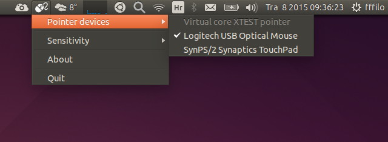
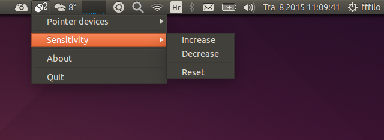
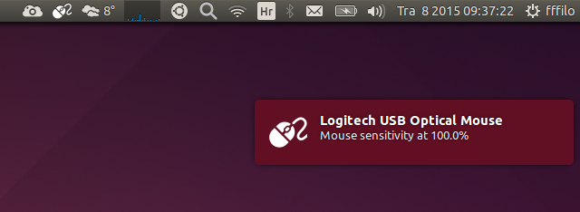

Mouse Sensitivity
=================

A simple mouse sensitivity indicator for Ubuntu: increase or decrease your mouse sensitivity with mouse wheel (or using indicator menu)...

### Indicator

### Notification

### How to install

	# clone repository
	git clone https://github.com/fffilo/mouse-sensitivity.git

	# move it to /usr/share
	sudo mv mouse-sensitivity /usr/share

	# create executable
	sudo sh -c "echo \#\!/bin/bash > /usr/bin/mouse-sensitivity"
	sudo sh -c "echo 'python /usr/share/mouse-sensitivity/src/mouse.py >/dev/null 2>&1 &' >> /usr/bin/mouse-sensitivity"
	sudo chmod +x /usr/bin/mouse-sensitivity

That's it, you're done. All you need to do now is type `mouse-sensitivity` in your terminal and indicator will be shown in notification area.
